# **Tutorial para preparação do ambiente de desenvolvimento**

Nesse tutorial vamos aprender. 
1) Como instalar o Visual Studio Code.
2) Fazer a instalação do compilador para C++.
3) Executar o nosso primeiro programa.

# **1) Instalando o editor de código Visual Studio Code.**

Visual Studio Code é um editor de código-fonte (gratuito) desenvolvido pela Microsoft para Windows, Linux e macOS, tendo suporte para várias linguagens de programação.

> O tutorial a seguir foi realizado no Sistema Operacional Windows 10.

## **Instalação**

1) Acesse o site oficial do Visual Studio Code: https://code.visualstudio.com/


2) Clique no botão "**Download**" para baixar o instalador.

<div align="center">

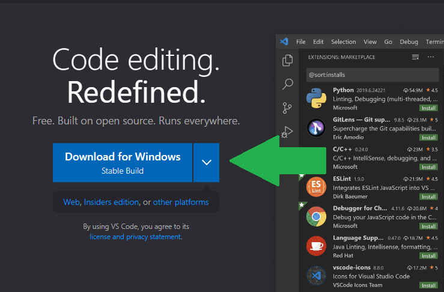

</div>

3) Escolha a pasta de destino e clique em "**Salvar**". Após o download finalizar, abra o arquivo.

4) Execute o arquivo baixado em modo **ADMINISTRADOR** e siga as instruções.

<div align="center">

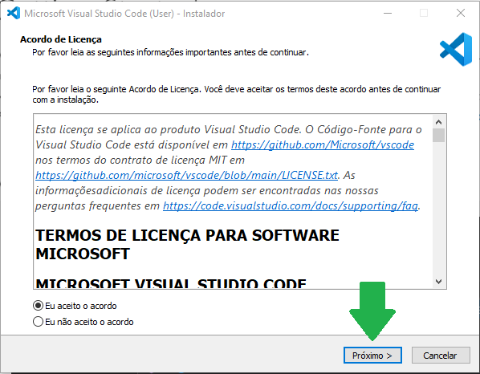

</div>

<div align="center">
    
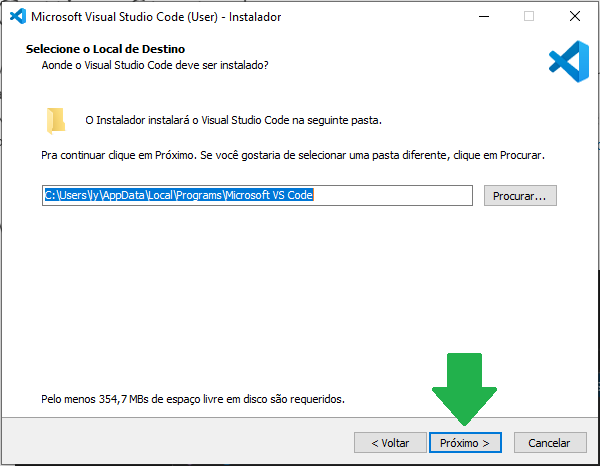   
    
</div>

<div align="center">
    
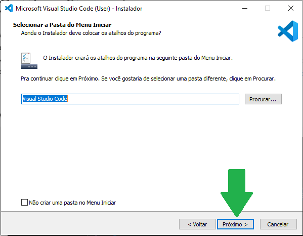

</div>

<div align="center">

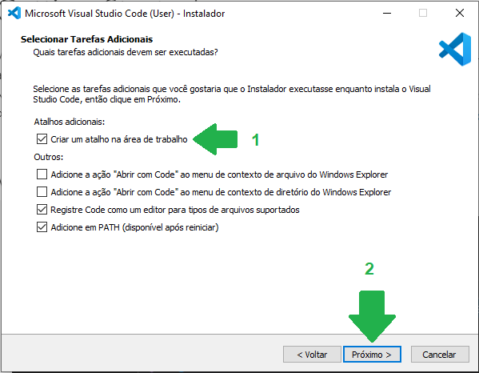

</div>

<div align="center">

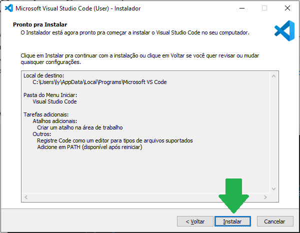

</div>

<div align="center">

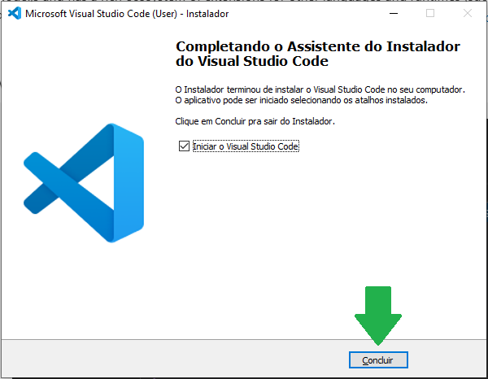

</div>

5) Após a instalação, abra o programa.

-------
# **2) Instalando o compilador de C++ MinGW.**

No próprio site do Visual Studio Code tem o link para o compilador. 


1) Acesse: https://code.visualstudio.com/docs/cpp/config-mingw

2) Descendo um pouco a página você encontra a opção de baixar o instalador. (*link to the installer*).


<div align="center">

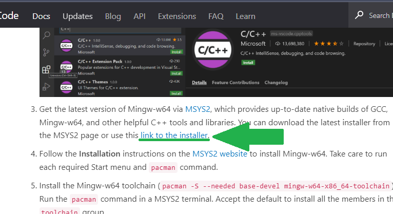

</div>

3) **OBS:** Após finalizar o download, execute o instalador em modo **ADMINISTRADOR**.

<div align="center">

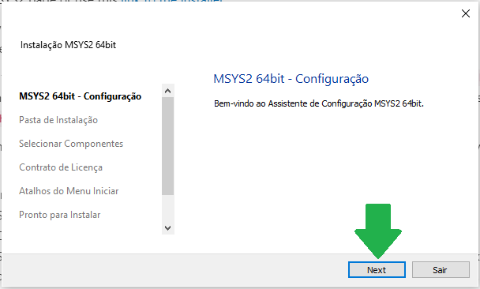

</div>

> **Atenção: Não mude o local da pasta padrão.**

<div align="center">

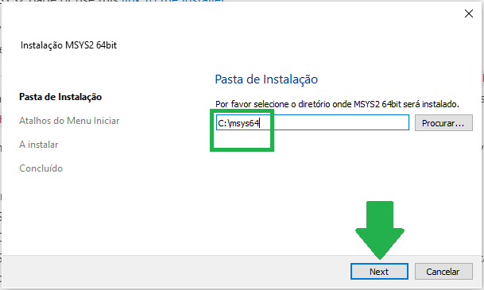

</div>

<div align="center">
    
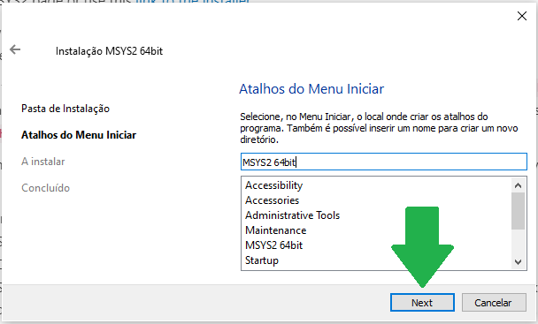
    
</div>

<div align="center">

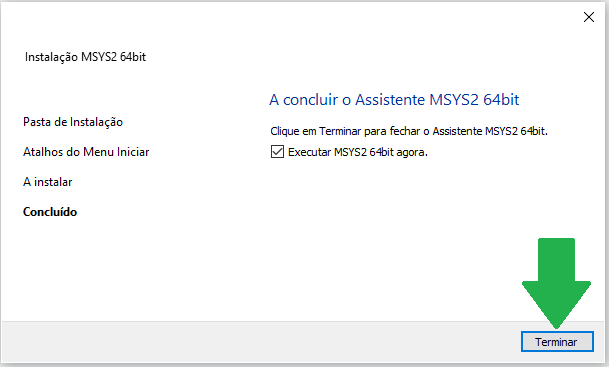

</div>

**Digite o comando no MSYS2.**

- ``` pacman -S --needed base-devel mingw-w64-x86_64-toolchain ```

<div align="center">

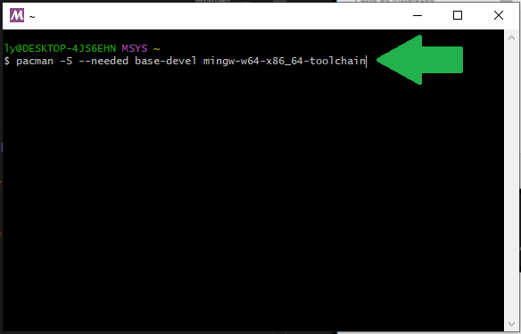

</div>

4) Aperte ENTER.

<div align="center">
    
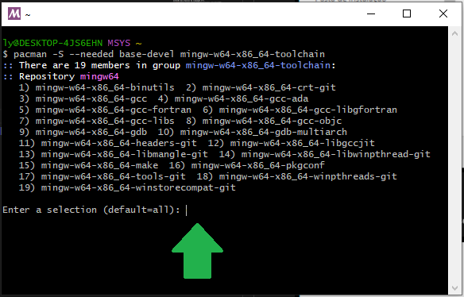

</div>

5) Aperte ENTER ou Y+ENTER para baixar os arquivos.

<div align="center">

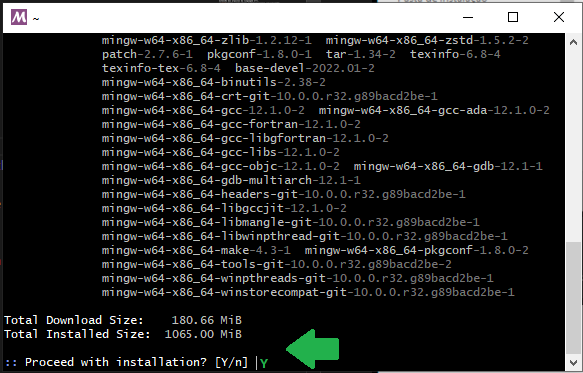

</div>


### Agora vamos configurar as variáveis de ambiente.

6) Aperte a tecla WINDOWS e digite 'configurações', digite **variáveis de ambiente** e clique em **Editar as variáveis de ambiente para sua conta**.

<div align="center">
    
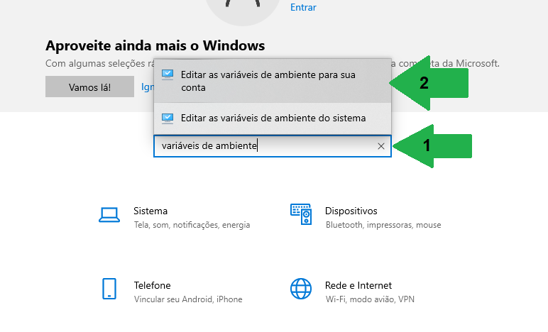

</div>

<div align="center">

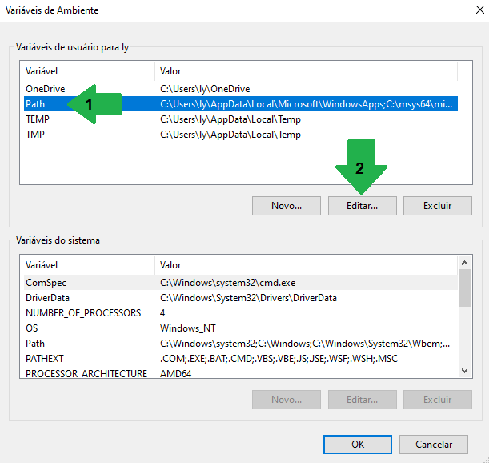

</div>

<div align="center">

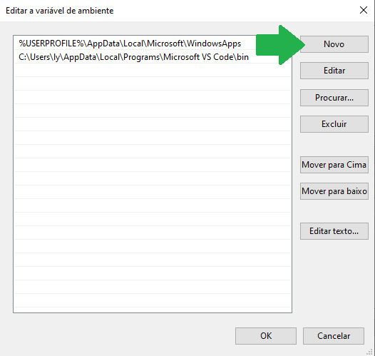

</div>

    OBS: Atenção ao caminho que você irá adicionar, ele precisa ser exatamente onde você instalou. 

7) A pasta padrão é essa: **C:\msys64\mingw64\bin**

<div align="center">

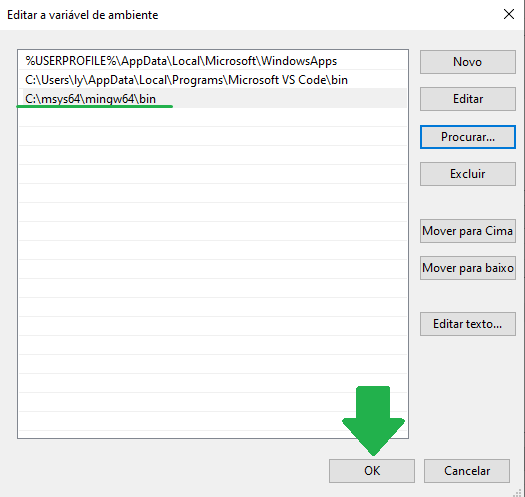

</div>

Verificando se tudo ocorreu bem, digite no **CMD**.

- ```g++ --version```

<div align="center">
    
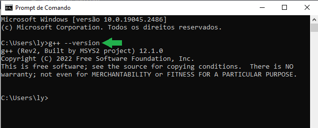

</div>

-------

# Criando o nosso primeiro programa.

1) Crie uma pasta no seu computador. Neste tutorial uma pasta chamada "workspace" foi criada na área de trabalho.

2) Utilizando o programa que instalamos, o Visual Studio Code.

<div align="center">

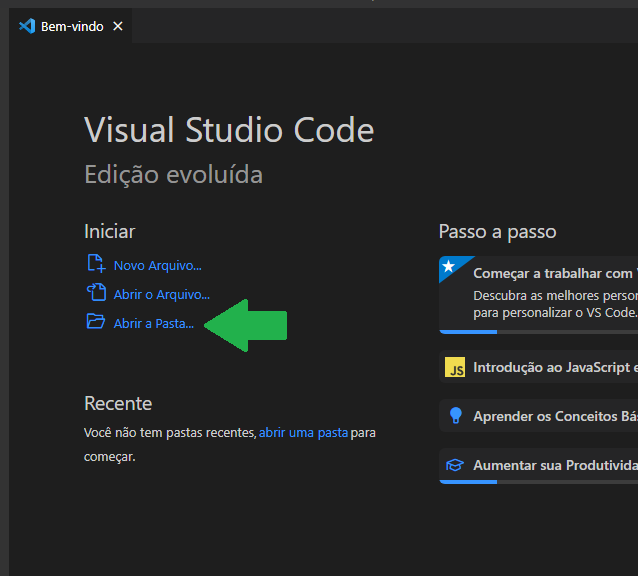

</div>

3) Selecione a pasta indicada.

<div align="center">
    
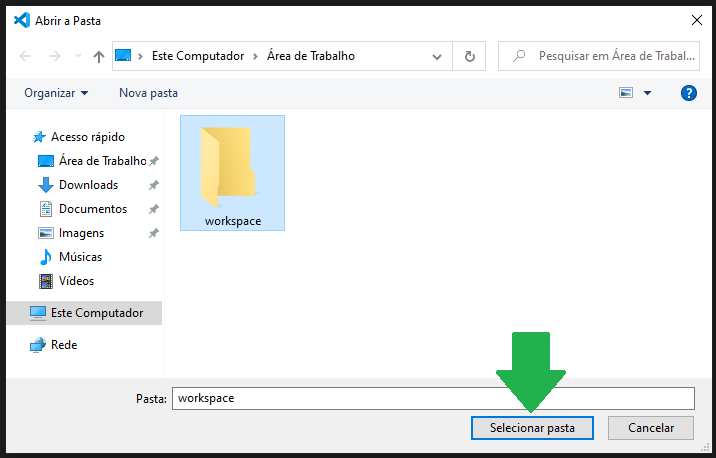

</div>

4) Crie o arquivo *helloworld.cpp*

<div align="center">

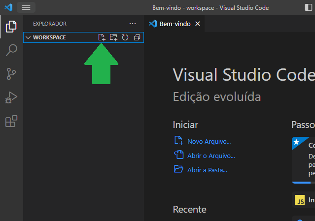

</div>

5) Observe o arquivo criado e em seguida escreva o seu primeiro programa.
Obs: Não esqueça da extensão no final do arquivo ".cpp"

```
#include <iostream>
using namespace std;

int main()
{
    cout << "Hello World! " << endl;
    return 0;
} 
```
<div align="center">

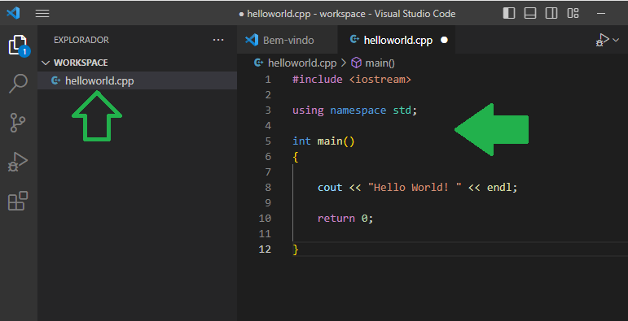

</div>

Salve o arquivo (Ctrl+S) e escreva no terminal do VS Code:

```g++ helloworld.cpp -o a``` 

Depois 

```.\a.exe```

<div align="center">

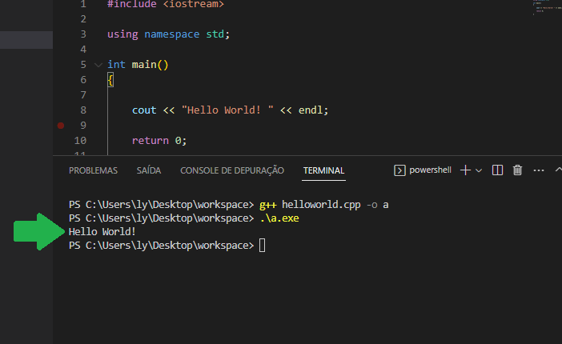

</div>

-----------

# Conclusão

O que aprendemos nesse tutorial?

1) Como instalar o editor de código VSCode.
2) Baixar e configurar o compilador.
3) Compilar e executar um programa. 

Agora o seu ambiente de desenvolvimento está pronto. Você já pode mergulhar nos estudos!
